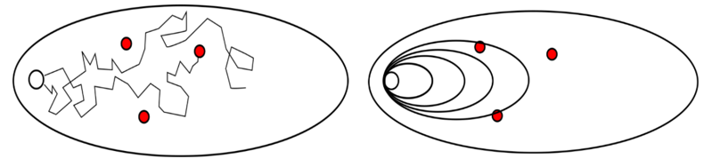
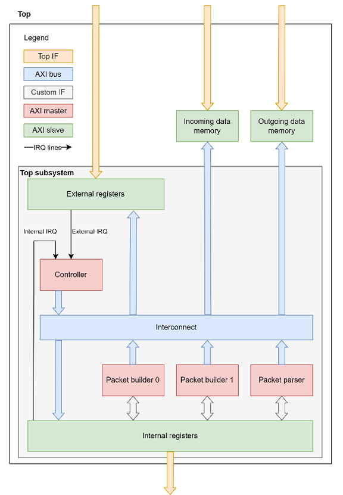

# Formal Verification of the Packet Processing System

The packet processing system is fully verified with the application of the formal methods. In this project many complexity reduction techniques (Cutpoints, Blackboxing, Case-splitting, Assume-Guarantees, Inital Value Abstractions) were applied in attempt to achieve the convergence of the main end-to-end property that should exhaustively prove the packet building process. They all made a good progress in terms of better bounded proofs, but never actually resulted in a full proof.

Convergence was achieved with the application of the JasperGold's SST (State Space Tunneling) method which serves to identify good candidates and hence develop new helper assertions. Helper assertion (Assume-Guarantee) reduces the state space for the tool to explore, effectively decomposing the hard problem into smaller, more manageable parts.

## Table of contents

- [Run Project](#run-project)
- [Formal Methodology](#formal-methodology)
- [System Workflow](#system-workflow)
    - [Data Integrity](#data-integrity)
    - [System Bottleneck](#system-bottleneck)
- [Formal Testbench](#formal-testbench)
    - [Complexity Reduction](#complexity-reduction)
- [State Space Tunneling](#state-space-tunneling)
    - [Proof By Induction](#proof-by-induction)
    - [Helpers Development](#helpers-development)
- [Results](#results)

## Run Project
1. Clone repository
2. Run make command
3. See [script description](./scripts/script_desc.md)

## Formal Methodology

<table style="border: none; width: 100%;">
    <tr style="border: none;">
        <td style="border: none; width: 100%;">
            FV tool mathematically analyses the full state space of a design, exploring all possible simulations, rather than trying specific values. It is not actually running all possible simulations, of course, but it will use clever mathematical techniques to consider all their possible behaviors. Simulation looks at individual points in the space of possible tests, while FV covers the whole space at once. Simulation is like throwing darts at a target, while FV covers your whole target with a paint roller.
        </td>
    </tr>
    <tr style="border: none; text-align: center;">
        <td style="border: none;">
             
            
        </td>
    </tr>
</table>

## System Workflow

- The described system is an AXI4-based system operating in a single clock domain. 
- The main purpose of the system is packet processing according to given transaction level protocol. 
- It should build packets from incoming, raw data and parse incoming packets to extract packet information and possible transmission errors.

### Data Integrity
### System Bottleneck

## Formal Testbench 
### Complexity Reduction

## State Space Tunneling
### Proof By Induction
### Helpers Development
## Results

