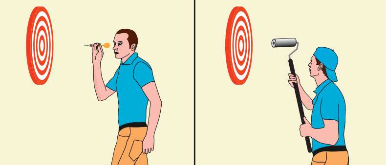
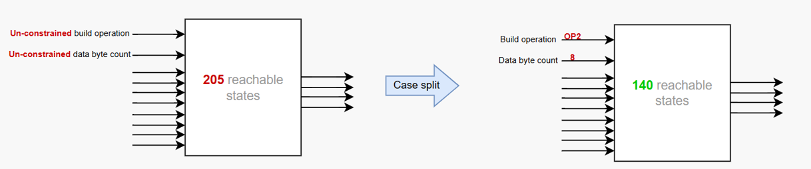

# Formal Verification of the Packet Processing System

The packet processing system is fully verified with the application of the formal methods. In this project many complexity reduction techniques (Cutpoints, Blackboxing, Case-splitting, Assume-Guarantees, Inital Value Abstractions) were applied in attempt to achieve the convergence of the main end-to-end property that should exhaustively prove the packet building process. They all made a good progress in terms of better bounded proofs, but never actually resulted in a full proof.

Convergence was achieved with the application of the JasperGold's SST (State Space Tunneling) method which serves to identify good candidates and hence develop new helper assertions. Helper assertion (Assume-Guarantee) reduces the state space for the tool to explore, effectively decomposing the hard problem into smaller, more manageable parts.

## Table of contents

- [Run Project](#run-project)
- [Formal Methodology](#formal-methodology)
- [System Workflow](#system-workflow)
- [Formal Testbench](#formal-testbench)
- [Complexity Reduction](#complexity-reduction)
    - [Data Integrity](#data-integrity)
    - [System Bottleneck](#system-bottleneck)
    - [State Space Tunneling](#state-space-tunneling)
        - [Proof By Induction](#proof-by-induction)
        - [Helpers Development](#helpers-development)
    - [Results](#results)

## Run Project
1. Clone repository
2. Run source fv_setup.csh
3. Run make command
4. See [script description](./scripts/script_desc.md)

## Formal Methodology

<table style="border: none; width: 100%;">
    <tr style="border: none;">
        <td style="border: none; width: 100%;">
            FV tool mathematically analyses the full state space of a design, exploring all possible simulations, rather than trying specific values. It is not actually running all possible simulations, of course, but it will use clever mathematical techniques to consider all their possible behaviors. Simulation looks at individual points in the space of possible tests, while FV covers the whole space at once. Simulation is like throwing darts at a target, while FV covers your whole target with a paint roller.
        </td>
    </tr>
    <tr style="border: none; text-align: center;">
        <td style="border: none;">
             
            
        </td>
    </tr>
</table>

## System Workflow

- The described system is an AXI4-based system operating in a single clock domain. 
- The main purpose of the system is packet processing according to given transaction level protocol. 
- There are two system workflows, packet building and packet parsing. External interrupts initiate the work of the controller which will start configuring internal registers and eventually start the processing block. Each block in the system communicates via AXI4 protocol and once the task is finished it raises the interrupt to signal the end of the work cycle. 
- It should build packets from incoming, raw data and parse incoming packets to extract packet information and possible transmission errors.
- The focus will be on the build task which consists of reading data from incoming memory, calculating the packet header and CRC based on it, and finally merging these parts into a packet which will be written into outgoing memory.

## Formal Testbench 

The testbench top-level is called fv_env. All of its ports are inputs, so it acts as a monitor of the DUT. It connects to the design via a bind statement. 

Under fv_env there are different components:

- SystemVerilog Modules
    - Adapter (fv_adapter) - Converts wires connected to the DUT into SystemVerilog Interfaces (SVIs) used by the testbench
    - Checkers (checker*) - Connect to DUT's interfaces and perform the checking of all design features.
- SystemVerilog Interfaces
    - Ports (*_port): Represents a group of DUT interface signals
    - Probes (*_probe): Similar to ports, but for signals probed inside the DUT (not at the interface) 

## Complexity Reduction

### Data Integrity

- Here I will describe the property that checks build functionality for which we try to reach the full proof. Packet structure can differ based on the selected build operation. There are 3 of them: Word, half-word, and LSB byte which represent the bytes used in the build process. 

- To check the packet structure, inside the checker, the chosen_byte free variable is used. Free variable can take any value at reset which will remain stable for one test case. But because formal methodology checks all these values in parallel, none of them will be missed. 

- This way chosen_byte chooses one byte to be checked for each test case reducing the number of state elements needed to store and compare the data on the input and output of the checker module. Thus making the formal analysis much more efficient.

- In this example, let’s say chosen_byte has the value of 8. Its position on the output depends on the build operation and can be calculated using simple math. After the packet is written, two memories are read and the data is compared to check for an error.

### System Bottleneck

- Even though it may seem simple, this property turned out to be very difficult to achieve full proof. The reason for that is mainly in the controller module which takes around 35cc to start the build task, which is already very deep into the state space making it hard to formally calculate next states in which build process occurs, and the reason for that is AXI protocol which consumes a lot of cycles to complete a transaction. Additionally, interconnect module can serve only one master at a time making it more difficult because other master are constantly competing for grant which further slows done the build process.

- All these obstacles contribute to property complexity because the behavior of interest happens very far from the reset state, making it difficult for formal analysis.

To address the complexity several techniques were used:

1. Case splitting – Dividing the problem into smaller cases, hence making the property logic simpler. We constrain the design to use only specific work modes in hope to easier achieving full proof for this case.

2. IVAs – Registers can take any value from reset, which means that initially, all masters can start working in parallel regardless of the controller work.

3. Stopats – Treating the controller as a black box whose outputs become free nets that the tool can drive. This generalizes the design, allowing blocks to start their processes regardless of the controller.

4. Assume-Guarantee (Helper Assertion) - Assertion that helps prove other assertions, as proven assertion can be effectively used as an assumption. Each helper has a smaller Cone of influence than the target property. Generally easier to prove.

**IVA Impact on Coverage**

### State Space Tunneling
#### Proof By Induction

- Let’s say we have a property P.
- For it to be proven true, it must hold true for all reachable states from the reset state.
The black square represents the full state space of the design, and the black circle represents the reachable state space, defined by the design implementation and formal assumptions.

- Our property P is true inside the green square. When the tool tries to prove P, it performs K-step induction, which means the property must be true for K cycles after the reset. 
The inductive step then asserts that if the property is true for K cycles from reset, it must also be true on the next cycle.

- Why does the tool struggle to prove P? The challenge for the tool is to analyze and determine the reachable state space. It needs to consider states outside of the reachable state space, where transitions causing the property to fail could occur. 

- It essentially wastes time trying to reach counterexamples beyond the reachable state space because it does not know this boundary. Helpers then serve to eliminate these unreachable transitions which would cause P to fail.

#### Helpers Development

- Helper assertions can be derived from the engineer’s insights about the design. However, if that approach does not yield significant results, a state space tunneling technique can be used. This technique is best applied in the late stages when other methods haven’t achieved the desired results.
- State space tunneling (SST) essentially allows any state element in the design to take any value, enabling the design to start from an arbitrary state. From this state, it can find a transition or counterexample (CEX) that will cause the property to fail. In most cases, this CEX will originate from unreachable state space.
- SST provides a trace of this CEX, from which we can derive a helper to rule out this behavior. This process can be repeated until there are no more CEXs. These CEXs are not real bugs because they do not start from reset. New helper assertions should be proven before being used as assumptions, which will then reduce the state space and accelerate property convergence.
- In each iteration, new helpers will be respected by the SST analysis, bringing us one step closer to proof closure.

### Results

- After many SST iterations, we should achieve a result where the target immediately converges because good helpers drastically reduce the state space which needs to be analyzed. (when turned into assumptions).
- This is the result in the Jasper Property table where SST-generated helpers were proven and converted into assumptions. 
- Target which previously would not converge for a long period of time, now converges immediately.

- The problem of achieving fast convergence is analog to water flow with multiple stones on its path. 
- Stones prevent water from reaching the sink as fast as possible, accumulating more water before each stone which resembles tool struggling to calculate a particular cycle depth. 
- Defining a new helper is similar to removing a stone obstacle allowing water to freely flow toward the sink, or in our case full proof.

